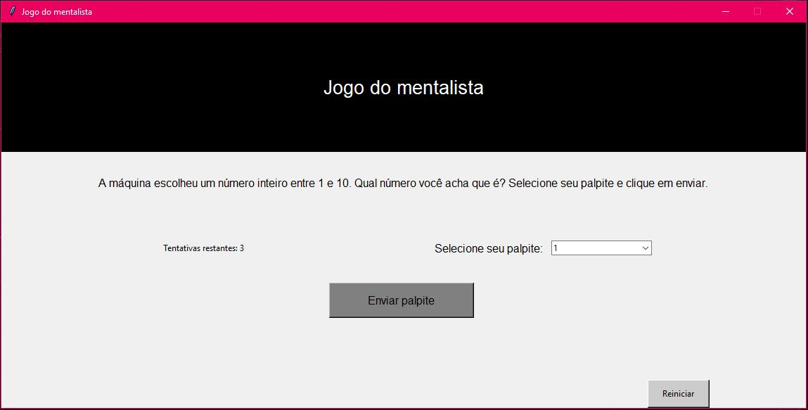

# Jogo Mentalista - em Python
Jogo contra a máquina no qual a máquina sorteia um número inteiro de 0 a 10, o usuário dá um palpite sobre qual é o número, se errar ganha uma dica e tem mais 2 chances para acertar.

## Linguagem utilizada
Python 3  
Escrito na versão 3.10, mas a sintaxe é simples e as bibliotecas são padrão, então creio que não terá diferença de uma versão para outra.

## Implementação
Para instalar o [Python 3](https://www.python.org/downloads/) clique no link, baixe o arquivo e siga a instalação padrão. 

O arquivo [mentalista.py](./mentalista.py) funciona apenas por linha de comando e o arquivo [mentalista_gui.py](./mentalista_gui.py) precisa só ser inicializado por linha de comando e o jogo funciona em uma interface gráfica.

Independente da versão escolhida, basta baixar o arquivo, pela linha de comando navegar até o arquivo no local salvo e executar o programa.

## Imagem da interface

